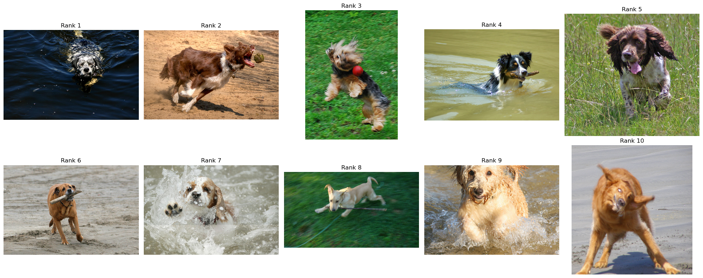

### Abstract

Final project for DTSA-5506, the final course in the Data Mining Foundations and Practice Specialization at the University of Colorado Boulder.

After a course on Deep Learning for NLP, I became interested in multimodal models that integrate text and images. I chose PaliGemma because it is publicly available, has pretrained checkpoints, and comes with detailed documentation from Google AI and Hugging Face.

The project had two goals:
1. Understand PaliGemma internally by implementing it from scratch. Thanks to [Umar Jamil](https://github.com/hkproj/pytorch-paligemma) for his GitHub repository, which served as a valuable reference during this project.
2. Evaluate PaliGemma’s performance on several data mining tasks, with a primary focus on cross-modal retrieval: retrieving relevant images given a query text. Experiments were conducted on the Flickr30k dataset

---

### Zero-Shot Image Retrieval

The repository includes a zero-shot image retrieval functionality, implemented in run_retrieval.py:

> Retrieve the top-k most similar images for a given text query in a zero-shot setting.

For example, given the text query:

**"A dog playing with a ball"**, the model retrieved the following top 10 images:

